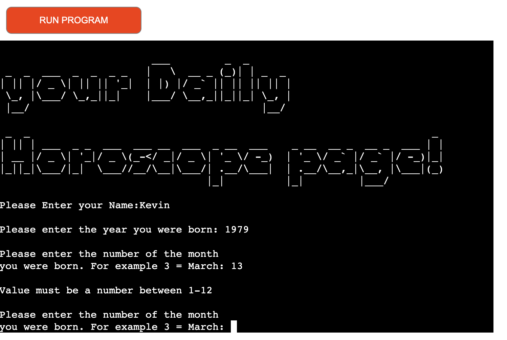

# Horoscope_P3  

The Horoscope_P3 project delivers a useable and intuitive program that prompts and takes in data from a user.  This data will then link to an external Google sheet and retrieve matching data based on what data is entered.  For example, if I enter my DOB as 12/08/1979 (separate prompts) this means that I am a Leo star sign, so if the user indicates they want to see the horoscope for today, the program will retrieve todays reading from the Google sheet, based on a worksheet and Cell reference which is linked to todays reading… if its Tomorrows, same logic, but using different cell reference.
There is a Worksheet for each star sign, and different readings for each sign and day.  So a user can retrieve a reading for yesterday, Today and Tomorrow for any star sign all via the prompts. 

# Features

- __Error Handling__
    
    - Year of birth
    When a user enters a year of birth, the program code checks if the data entered is numeric.  If not numeric, the program will post an error (This is not a number, please re-enter), and will re-prompt until a valid number is entered. 
    I also added error-handling to not allow negative values added.

    - Month of birth
    When a user enters a month of birth, again the program will check if the data entered is a numeric value, and if not will provide an error (Value must be a number between 1-12), and will continue to re-prompt until numeric value is added.  The program will also check if the value entered is >12, and if so will display an error (Value must be a number between 1-12) and will re-prompt until a numeric value between 1-12 is entered.
    I also added error-handling to not allow negative values added.

    

    - Day of birth
    When a user enters a value the program will once again check if numeric and will display an error if not.  There will also be an error displayed if the day does not match the month added…. this is controlled by the imported datetime method.  
    I also added error-handling to not allow negative values added.

- __Star Sign calculation__

- The program code will decipher what the user star sign is based on the data the user enters.  This is why instead of asking for DOB as one input, it was vital is ask for year, month and day separate.  The calculations are done by using the month and in particular the day of month to understand what sign is correct.

- __Data retrieval__

- I have created an external [Google Sheet](https://docs.google.com/spreadsheets/d/1CEI56um2eTA1yMyG832TtSUhkDg4cUDIjdaxL32IrFg/edit?pli=1#gid=0) in which I house all the horoscope data.  Based on the calculations and the options chosen by user, the program will select the correct worksheet and cell in relation to the data that will need to be displayed.  Based on sign, and whether its yesterday, today or Tomorrow, the program will grab the correct value. 

- __Multiple choice options__

- During the program, the user will be prompted with options to choose on whether they want to continue with more readings, if after todays reading, if the user wants tomorrows, they will be prompted about yesterdays, then again if chooisng to see yesterdays, they can start program again to run through with fresh data or end the program.  The user can choose no for Tomorrows reading, but will still get the option to see yesterdays, but again if chooisng no, the user will get a chance to start again or exit.  I feel that the usability of the program is strong, with the user is never left confused as to what are next steps or how to continue running it with different options.

# Features left to implement

- If I had further time, I would ideally like to add better error handling around the day entry input.  It would probably have required an array or set of data, or I may have been able to do it via the external sheet.
- Adding data - My program only retreives data and displays for the user.  Another feature that could be implemented is the option to perhaps add or manipulate the data.  Perhaps add a admin user to add or update the readings via the program and not just update via the physical sheet.

# Testing

- There was a lot of testing of this program throughout.  It was a tricky piece of code to write, so required lots of test, re-run, modification of code and repeat.  Testing that will not neccearily documented.
- I would say the bulk of the testing was around the if statements, and trying to make sure that the program carried out the correct action based on option slected by the user.
- The sharing and passing of variable data also caused me a lot of problems, and it meant I was calling functions from within other functions, which was not really my plan... this took a lot of time and testing to get right.
- I have tested this program thoroughly, lots of negative testing, error handling checks, correct readings being displayed etc... I have documented the user case testing [here](https://docs.google.com/spreadsheets/d/1qZD24CFKM44kvPzQZTWK6VcLEgmZM38yjjDgyqbEkqw/edit#gid=0)
- Technical Testing/Code validator was done via importing the PEP8 validator into GitPod.  There still remains some slight issues in the code with different coloured lines...but I have tried my best to clear these for when it makes sense.  There are some I really dont understand nor can I fix...but these do not hamper my program.

# Unfixed Bugs

- I missed the fact that a user can add a year greater than today or over all date greater than today, so there age is actually a minus number... This is not great.  If time permitted, I would retreive todays date, extract the year, and make sure the input is not greater than this year.  As a quick fix, I've hardcoded 2022 in an error handler and raise an error if greater than.
- I'm pretty happy with how the code is working, I wouldn't say there many other remaining bugs.  What I already referenced perhaps is the fact that I rely on the datetime method to handle the day entry errors..which actually ends the program - ideally this would be handled and remain in program.  This only happens if a day is entered that does not satisfy the day.  Again, as a quick fix, I hardcoded if the inout is >31 to throw and error, but this is not ideal.

# Deployment

- In order to deploy my project and make it available to run via a visual program, I needed to synch my GitHub project through Heroku.  I had to sign up for a new account, add credentials, link to the correct repository and add some settings to allow for seemless deployment.  One thing I made sure to do was set to automatic deploys, which meant each time I pushed through gitpod, these changes would then render to the new GUI. My Heroku dashboard - https://dashboard.heroku.com/apps/horoscope-p3/deploy/github 
- My project is deployed via Heroku.  My live published site - https://horoscope-p3.herokuapp.com/
- My GitHub repository is housed here - https://github.com/kevinmcsherry/Horoscope_P3 

## Credits 

I used a number of different websites and did a lot of searching throughout the project.  I really tried to understand the logic that I was finding and implement in my own code, and not just copy and paste in.  I may have lost a lot of time here, but I wanted to understand and learn.
I followed the love sandwiches project closely, and used as much of the thought and layout of this.
I used well known coding sites like Stackoverflow and W3Schools.  I would have really struggled without these reference points.
I required a bit of help with the logic for the horoscope sign calculation, and I leaned on a resource https://www.w3resource.com/.  
Part of the coding piece I struggled with was to share variables across functions, I did quite a bit of searching for what I could find around this, I found a helpful video on youtube that helped me - https://www.youtube.com/channel/UCSSNp6PBXNvlt0VQQPAmD0Q
Of course, I needed help with genuine horoscope content and I got this from http://Horoscope.com 

# Project summary 

- I was really looking forward to this section of the course and the project.  I enjoyed Javascript and therefore I believed that python would be similar.  It was not!  I found it more challenging.  The coding structure is very different and I found it a quite a bit more difficult to follow.
- As for the project, I wanted to remain orignal and come up with an idea of my own and not rely on suggested projects where there was a lot of code and help provided.  I hope this come across in my work and that I am recognised for that.  My code is not perfect, but I much prefer working through this with as little help as possible - not becuase I think that seeking help is wrong and can be quicker...but I really want to learn and understand, which definitely is the case with this project.
- I think the horoscope is a good idea, and is quite useful too, as this is something that people are interested in and something that has real life uses. 

